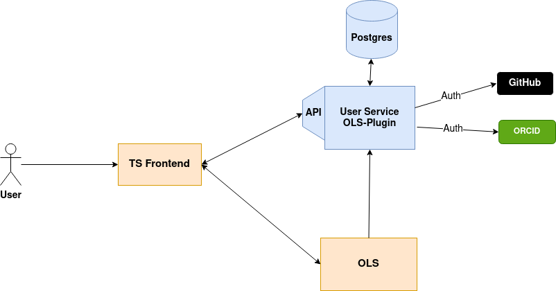

# User Data Micro Service for TIB Terminology Service V2.0

The Plugin services for adding extra features to a Terminology Service. 

Swagger: https://service.tib.eu/ts-plugin/documentation

Hosted: https://service.tib.eu/ts-plugin

## Tasks
- Authentication 
- Note feature in TS
- Github related queries for TS
- User defined Collection
- Admin functions

## Stack
- Flask
- PostgreSQL
- Nginx

## List of modules and endpoints

Swagger: https://service.tib.eu/ts-plugin/documentation

## Test
The test materials and source code are in **tests/** directory.

To run them, you need to run the test docker composer that creates the test environment with a fresh database.

### Authentication code for testing
The authentication (test_login.py) Test part requires the login code as input. You need to manually create the login code by opening these links and authenticate yourself:

- Github: https://github.com/login/oauth/authorize?scope=user&client_id=b2c81399376da40700c9

- ORCID: https://sandbox.orcid.org/oauth/authorize?response_type=code&scope=/authenticate&client_id=APP-6W3MM8J52OXM6DYD&redirect_uri=http://www.localhost:3000/ts/

After you autheticate, copy the code (after code= in the url) in to the env variable name "GITHUB_LOGIN_CODE" and "ORCID_LOGIN_CODE" (for Github and ORCID) in the .env file in the tests/ directory.

### Other tests

For the other tests, just use a valid token in the .env file for test. (To avoid producing new login code each time). Vars to use are:

- GITHUB_TEST_ACCESS_TOKE
- ORCID_TEST_ACCESS_TOKE
- ORCID_LOGIN_USERNAME

### Run the test
After running the composer, you can run the tests inside the backend container. First:

        :~$ docker exec -it ts-plugin bash

then inside the container: 

        ts-app:~$ cd tests/
        ts-app:~$ pytest

## License

MIT License
